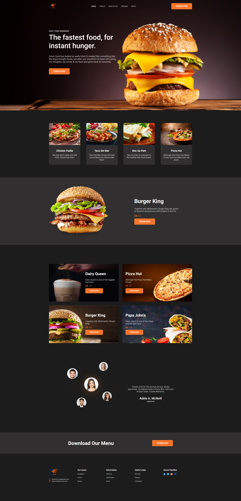

# Fast Food - Лендинг для сети ресторанов быстрого питания

## 🌟 Особенности

- **Адаптивный дизайн** - корректно отображается на всех устройствах (десктоп, планшеты, мобильные телефоны)
- **Современная CSS-архитектура** - раздельные файлы стилей для шапки и основной части
- **Семантическая верстка** - правильное использование HTML5 тегов
- **Оптимизированные изображения** - контентные изображения и иконки в соответствующих форматах
- **Интерактивные элементы** - плавные hover-эффекты и переходы
- **Кастомный шрифт** - подключение Google Fonts (Roboto)
- Методология БЭМ

## 🛠️ Технологии

- HTML5
- CSS3
- Flexbox
- CSS Grid
- Медиа-запросы (Mobile First подход)
- Google Fonts

## 📋 Секции сайта

- **Header** - навигационное меню и логотип
- **Welcome** - главный экран с призывом к действию
- **Food List** - карточки популярных блюд
- **Order** - информация о бургерах
- **Product** - карточки продуктов с ценами
- **Feedback** - отзывы клиентов
- **Download** - секция скачивания меню
- **Footer** - контактная информация и ссылки

## 🌐 Сслылка на сайт:
**https://burger-landing-project.firebaseapp.com/**

